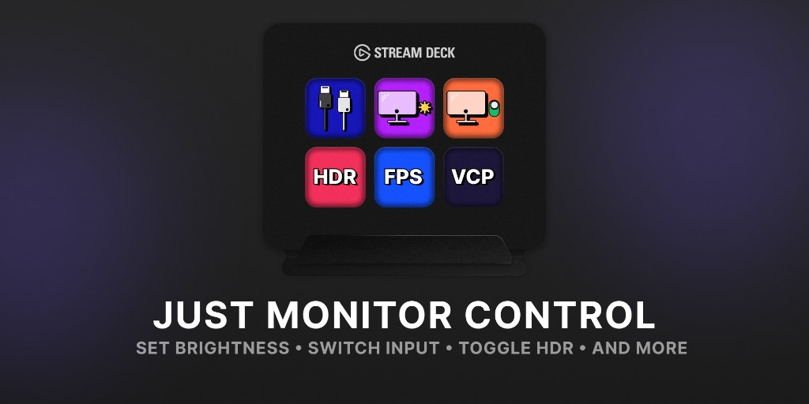

English | [Русский](README.ru.md) | [简体中文](README.zh-CN.md)

# Just Monitor Control

A Stream Deck plugin for Windows. It controls monitor brightness, video input, refresh rate, HDR, and sleep.

## Features

| Action | Description |
| --- | --- |
| Brightness | Set an exact level, step it up or down, or switch between two saved states, on several monitors at once. |
| Contrast | Set an exact contrast level, step it up or down, or switch between two saved levels. |
| Monitor Volume | Set, step, or mute the volume of the monitor's own speakers. This is not the Windows volume. |
| Input Switch | Switch to a specific port, or between two, for example DisplayPort and HDMI. |
| Refresh Rate Change | Refresh rates reported by Windows, including exact modes such as 59.94 Hz. |
| HDR | Turn HDR on or off for one monitor or for every selected monitor. |
| Sleep & Wake | Sleep selected monitors or the whole desktop, then wake them again. |
| Raw VCP | Any VESA VCP code and value for controls that do not have their own button. |
| Identify Displays | A number appears briefly on each screen, so the names in the dropdown can be matched to the real monitors. |

## Requirements

- **Elgato Stream Deck app**: Version 6.9 or higher.
- **System**: Windows 10 (1809 or later) or Windows 11.
- DDC/CI enabled in the monitor menu.
- A direct DisplayPort or HDMI connection. Some USB-C hubs and passive adapters do not pass commands through to the monitor.

## Installation

1. Download the latest version from the [Releases](https://github.com/valentderah/stream-deck-just-monitor-control/releases) page.
2. Double-click the downloaded `.streamDeckPlugin` file to install the plugin.
